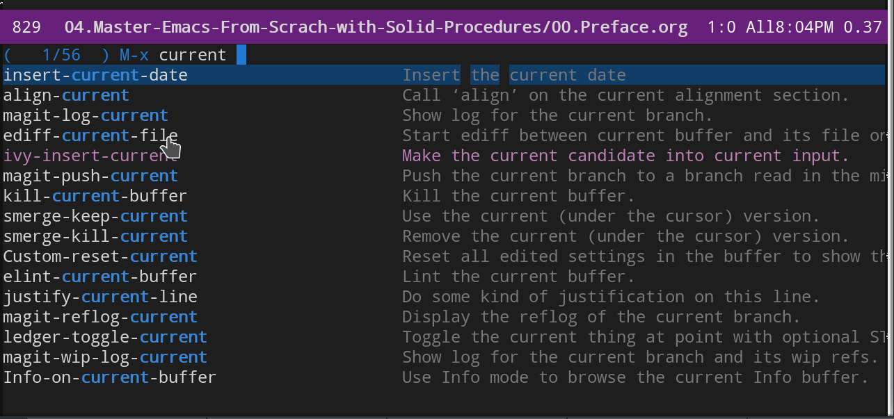
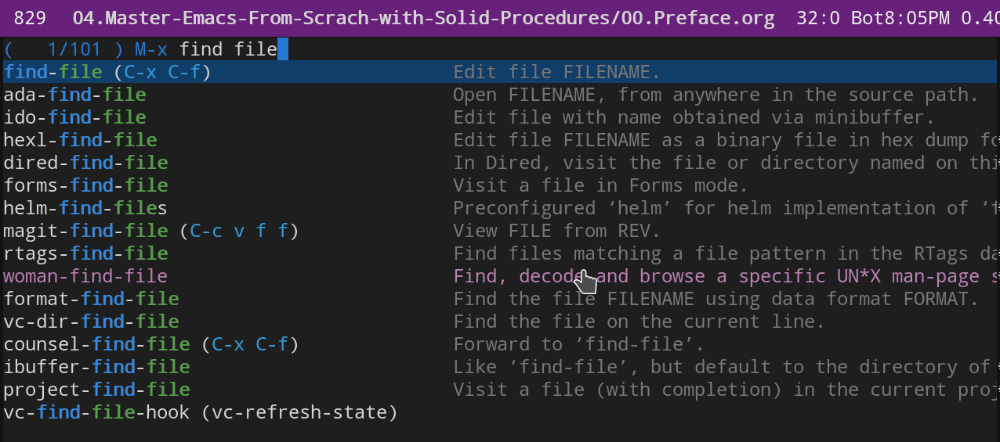

# Master Emacs with Solid Procedures

# 0.Prelude

Prejudices say: \"Emacs is just hard to learn\". Such prejudices undermine Emacs\' popularity.

This minor project try to break the prejudice and denote how could take least efforts and suffering to learn Emacs.

> This series blogs were written originally in Chinese, so translating might take nights.

Emacs is simple and its universe big-bang from M-x.

# 1.So simple Emacs: Meta Key

Emacs\' elegance and simplicity, in a nutshell, is just a Meta key. Meta is option or alter key on the keyboard. In etymology, Meta means "higher, beyond\". Therefore, as spring flows from higher source, we could understand Meta as Source, and associated it with source-code.

In Source Code, function is the first-class citizen. The simple strategy of Emacs is to bind the Meta key (which has source meaning in etymology) to the source-code or function. Then we could trigger the keys M-x (x for execute) to invoke the function.

Start form M-x, you can do whatever you desire, such as inserting the current date:

Until now, all the designing works of Emacs in the strategic level have been finished. The only remaining things are in tactical level about how to implement functions which M-x invokes.

# 2.The primary strategy of Emacs: Introduce the Ctrl key

Take an example to open a file from a directory, you can M-x find-file,

With M-x, we have to type 11 characters to get such a task done. In contrast, we only type 4 characters as C-x C-f with Ctrl key. As we see, to achieve high efficiency, Emacs\'s primary strategy is to replace "call function by full name\" with the \"call function by characters\".

A simpler example, such as \"move one character forward\". The complete implementation is M-x forward-character. But after the introduction of the Ctrl strategy, only the characters of C-f is required.

Since C (Ctrl) simplifies M-x, and the character f is the first letter of the function forward-character.

The above method of calling functions with Control is called Command. Command is equivalent to Ctrl, we find that choosing Ctrl as command is also a semantic binding just as choosing Meta as source-code.

# 3.Contents

- [Chinese Version 中文版](readme-cn.org)
- [00.Prelude](00.prelude.org)
- [01.Semantic Keybindings](01.semantic-keybinding-en.org)

  ------------------------------------------------------------------------

- The successive chapters are in translating.....
- 02.Emacs as an editor
- 03.God\'s eyes and hands by Dired
- 04\*.The Structure of Emacs(Chinese version in progress)
- 05.Read a book in a serious way
- 06.Emacs as an Agenda by Org
- 07.Improve org workflow
- 08.Programming
- 09.Assistance to programming
- 10.Literature Programming
-   Appendix A \~ H

 and thank you.

